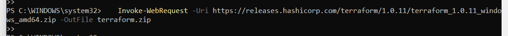

# Configuração do Terraform com AWS

Este guia detalhado ensina como usar o Terraform para gerenciar recursos na AWS. 

## Pré-requisitos

Antes de iniciar, certifique-se de que você possui o seguinte:

- Conta na AWS Academy: [AWS Academy](https://aws.amazon.com/academy/)
- Terraform CLI instalado
- AWS CLI instalado

## Instalação do Terraform CLI

Para instalar o Terraform no Windows usando PowerShell, siga estes passos:

1. **Abrir PowerShell como Administrador:**
   - Clique com o botão direito no menu Iniciar e selecione 'Windows PowerShell (Admin)'.
    

2. **Baixar o Terraform:**
   ```powershell
   Invoke-WebRequest -Uri https://releases.hashicorp.com/terraform/1.0.11/terraform_1.0.11_windows_amd64.zip -OutFile terraform.zip
   ```
     


3. **Extraia o arquivo ZIP:**
   ```powershell
    Expand-Archive -Path terraform.zip -DestinationPath C:\terraform
   ```
    

4. **Adicione o Terraform ao PATH do sistema:**
   ```powershell
    [System.Environment]::SetEnvironmentVariable('PATH', $env:PATH + ';C:\terraform', [System.EnvironmentVariableTarget]::Machine)
   ```
    

5. **Verifique se foi instalado:**
   ```powershell
    terraform -v
   ```


## Instalação do AWS CLI

1. **Baixar o instalador do AWS CLI:**
   ```powershell
    Invoke-WebRequest -Uri https://awscli.amazonaws.com/AWSCLIV2.msi -OutFile AWSCLIV2.msi
   ```

2. **Instalar o AWS CLI:**
   ```powershell
    Start-Process msiexec.exe -Wait -ArgumentList '/I AWSCLIV2.msi /quiet'
   ```

3. **Verificar a instalação:**
   ```powershell
    aws --version
   ```

## Configuração das credenciais do AWS

1. Abra o AWS Academy e inicie um módulo:
    - Escolha um curso que você esteja inscito:
    

    - Vá na aba Módulos e depois acesse o Laboratório de aprendizagem da AWS Academy:
    

    - Inicie o lab:
    

2. Para configurar as credenciais va no PowerShell e digite 
   ```powershell
    cd ~\.aws\
   ```


3. Abra o arquivo credentials no notepad pelo comando:
    ```powershell
    notepad credentials
   ```

4. Vá até o AWS Academy e pegue suas credenciais :

    

5. Cole elas no notepad que você abriu

## Criando uma Instância EC2 com Terraform:
    
1. Crie um arquivo de configuração Terraform chamado main.tf com o seguinte conteúdo:
```
provider "aws" {
  region = "us-east-1"
}

resource "aws_instance" "example" {
  ami           = "ami-0c02fb55956c7d316"  # Amazon Linux 2 AMI (HVM), SSD Volume Type
  instance_type = "t2.micro"

  tags = {
    Name = "TerraformExample"
  }
}   
  
   ```

## Criando a instância: 

1. Abra o terminal e execute o comando:
```
terraform init
```

2.Para ver o que será criado, execute:
```
terraform plan
```

3. Para criar a instância EC2, execute:

```
terraform apply
``` 

Digite **yes** quando solicitado para confirmar a aplicação da configuração.

4. Limpe a infraestrutura com:
```
terraform destroy
```

### Passo a passo com prints:

   

 
 
 
 
 
 
 
 
 
 
 

 - No final é possivel ver a instancia criada no AWS:

  


